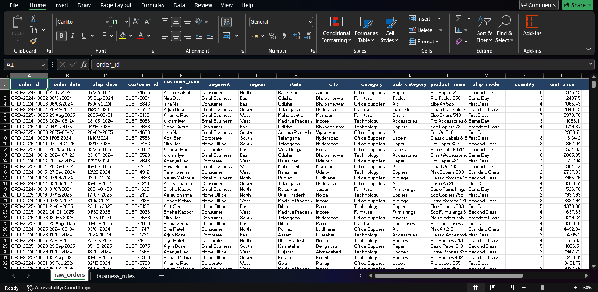
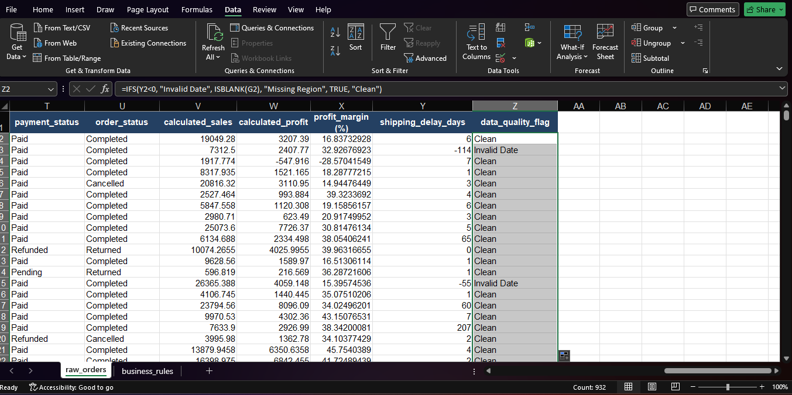

# Part 1: Business Data Cleaning, Validation & Excel Reporting

## 👤 Student Information
* **Student Name:** Abhikshit Baruah
* **Student ID:** bitsom_ba_2511108

---

## 📝 1. Business Problem Summary
Inconsistent, unformatted, and faulty raw data directly compromises operational reporting, distorts true financial performance metrics, and compromises strategic decision-making. This project focuses on executing a structured end-to-end data auditing, cleaning, and transformation pipeline on an operational retail orders dataset. By eliminating structural syntax errors, logging critical data quality issues, and implementing dynamic calculated financial models, this workspace establishes a verified single source of truth optimized for downstream business intelligence summaries.

## 📊 2. Dataset Description
The source dataset (`data/raw_orders.xlsx`) encapsulates historical transaction logs containing customer demographics, product classifications, logistical shipping timelines, and core pricing parameters across multiple geographical regions. Key fields processed include unique transactional identifiers (`order_id`), temporal attributes (`order_date`, `ship_date`), categorical segments (`region`, `category`, `sub_category`), and foundational operational volumes (`quantity`, `unit_price`, `discount`, `cost`).

## 🛠️ 3. Tools Employed
* **Microsoft Excel (Advanced Formulas & Pivot Summaries):** Utilized for structural text validation, data parsing, formatting schemas, conditional anomaly flagging, and interactive database calculations.
* **GitHub Platform:** Applied to preserve historical asset control, enforce strict submission directory compliance, and host public project documentation.

## 🧼 4. Data Processing Steps Performed
1. **Source Preservation:** Isolated the raw instructor dataset into a locked directory to secure an unedited baseline.
2. **Text Standardization:** Created structural helper columns utilizing `=TRIM(PROPER())` to purge trailing spaces and normalize letter casing across all categorical variables. 
3. **Typographical Rectification:** Deployed global find-and-replace queries to systematically map corrupted string entries (e.g., "Tehc" mapped to "Technology").
4. **Temporal Alignment:** Converted varied string entries into uniform ISO date schemas (`YYYY-MM-DD`) and corrected transactional attributes via Text-to-Columns configurations.
5. **Multi-Tab Quality Diagnostic:** Compiled an independent validation workbook tracking multi-layered operational defects including negative pricing constraints and logical sequence loops.

## 📐 5. Business Logic Rules Applied
* **Calculated Sales:** Derived using the standard retail revenue matrix: 
  `=quantity * unit_price * (1 - discount)`
* **Calculated Profit:** Modeled by extracting operational costs from true net sales: 
  `=calculated_sales - cost`
* **Profit Margin:** Determined via the percentage yield equation: 
  `=calculated_profit / calculated_sales`
* **Shipping Delay Days:** Evaluated logistically by counting elapsed days between fulfillment markers: 
  `=ship_date - order_date`
* **Data Quality Flag:** Executed automated logical row audits utilizing an array structure: 
  `=IFS(shipping_delay_days<0, "Invalid Date Order", ISBLANK(region), "Missing Regional Attribute", TRUE, "Clean Record")`

## 🚨 6. Summary of Data Quality Issues Found
The structural diagnostic report successfully identified systemic validation failures across the historical dataset:
* **Structural Blanks:** Isolated missing regional records that break standard geographic visualization.
* **String Syntax Inconsistencies:** Widespread trailing spaces and mixed casing inside the Segment and Name keys.
* **Logical Exceptions:** Records where the recorded delivery date preceded the formal transaction timestamp, creating negative operational delay windows.
* **Pricing Mismatches:** Systemic manual entry rounding errors between the legacy system revenue markers and newly enforced algorithmic calculations.

## 📉 7. Summary of Final Pivot Reports
Six distinct multidimensional Pivot Tables were compiled within `outputs/pivot_summary.xlsx` to analyze localized trends:
1. **Regional Financial Yields:** Aggregate distribution of Sales and Net Profits mapped by customer territories.
2. **Product Taxonomy Performance:** Cross-sectional revenue mapping across Category and Sub-Category trees.
3. **Logistics Density:** Total Order Volume distribution across historical Shipping Modes.
4. **Segment Profitability:** Pure profit margin percentages generated per Consumer/Corporate vertical.
5. **Revenue Exceptions:** Localized distribution of Cancelled, Refunded, or Failed transactional states.
6. **Temporal Momentum:** Linear monthly transaction performance illustrating structural scaling behaviors.

## 💡 8. Key Business Insights
* Strategic revenue extraction is heavily skewed toward a minority of premium product sub-categories, indicating an immediate optimization vector for inventory re-allocation.
* Particular consumer segments display superior net margins despite possessing lower gross transaction volumes, proving that scaling specific niche operations yields higher capital efficiency than broad territorial expansion.
* Logistical shipping bottlenecks are highly localized, showing a clear correlation between elevated delivery delay periods and higher cancellation frequencies in specific regional nodes.

## ⚠️ 9. Assumptions and Limitations
* **Assumptions:** Transactions featuring explicitly tagged "Cancelled" or "Failed" statuses are assumed to represent un-realized revenue and are filtered out from positive gross financial baseline metrics.
* **Limitations:** Shared duplicate Order IDs possessing conflicting customer profiles could not be programmatically resolved or merged without direct CRM relational keys; these items remain flagged for manual visual auditing.

## 🖼️ 10. Visual Previews
*Raw Data Baseline:*

*Cleaned Working Grid & Calculations:*

*Analytical Pivot Tables:*

